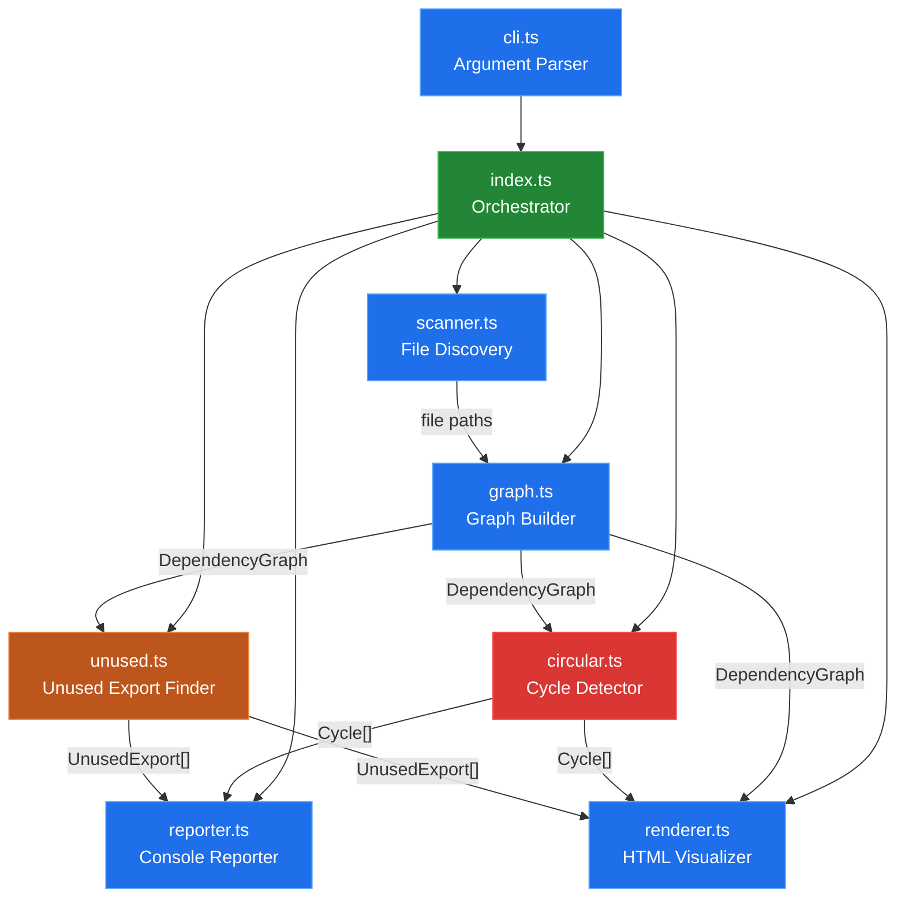

# 🌿 tracevine

**A terminal-native TypeScript/JS dependency graph tracer** — detects circular dependencies, finds unused exports, and generates interactive HTML visualizations.

> *Scheduled and generated by [hellohaven.ai](https://hellohaven.ai)*

[](https://www.typescriptlang.org/)
[](./LICENSE)
[](https://nodejs.org/)

---

## Why tracevine?

As TypeScript projects grow, the import graph becomes invisible spaghetti. Circular dependencies cause subtle bugs and prevent tree-shaking. Unused exports bloat bundles and confuse developers.

**tracevine** crawls your project's source tree, builds a complete dependency graph, and gives you three things in seconds:

1. 🔴 **Circular dependency detection** — DFS-based cycle finder with deduplicated, normalized output
2. 🟠 **Unused export discovery** — finds exports that no other module imports
3. 🟢 **Interactive HTML visualization** — force-directed graph powered by vis.js, color-coded by status

All from a single zero-dependency CLI command. No config files. No plugins. Just run it.

---

## Features

- **Zero runtime dependencies** — only `typescript` and `@types/node` as dev deps
- **Fast recursive scanning** with configurable extensions and ignore patterns
- **Smart import resolution** — handles relative paths, index files, and multiple extensions
- **Regex-based parsing** — no AST overhead, handles `import`, `require`, `export`, and re-exports
- **Beautiful terminal output** — box-drawn summary table with ANSI colors
- **Interactive HTML graph** — zoom, pan, hover for details, color-coded nodes
- **Strict mode** — exit code 1 on cycles, perfect for CI/CD gates
- **Self-analyzing** — run tracevine on its own source code!

---

## Architecture



---

## How It Works

### Phase 1: File Discovery
The **Scanner** walks the directory tree recursively, filtering by file extension (`.ts`, `.tsx`, `.js`, `.jsx`) and respecting ignore patterns (`node_modules`, `dist`, etc.).

### Phase 2: Graph Construction
The **GraphBuilder** reads each file and extracts imports using regex patterns that handle:
- `import { x } from './module'`
- `import x from './module'`
- `import * as x from './module'`
- `import './side-effect'`
- `const x = require('./module')`
- `export { x } from './module'`

Imports are resolved to actual file paths by trying extensions and index files.

### Phase 3: Circular Detection
The **CircularDetector** runs DFS with a recursion stack. When a back-edge is found (a node already on the stack), the cycle is extracted. Cycles are normalized (rotated to start from the lexicographically smallest node) and deduplicated.

### Phase 4: Unused Export Analysis
The **UnusedExportFinder** compares each module's exports against what other modules actually import from it. Entry points are detected heuristically and excluded.

### Phase 5: Reporting
The **ConsoleReporter** outputs a box-drawn summary and detailed findings with ANSI color coding.

### Phase 6: Visualization
The **HtmlRenderer** generates a self-contained HTML file using [vis.js](https://visjs.org/). Nodes are colored by status: blue (clean), red (in cycle), orange (has unused exports), green (entry/root).

---

## Repository Structure

```
tracevine/
├── src/
│   ├── index.ts        # CLI entry point & orchestrator
│   ├── cli.ts          # Argument parser
│   ├── scanner.ts      # Recursive file discovery
│   ├── graph.ts        # Dependency graph builder
│   ├── circular.ts     # Circular dependency detector
│   ├── unused.ts       # Unused export finder
│   ├── reporter.ts     # Terminal reporter with ANSI colors
│   └── renderer.ts     # Interactive HTML graph generator
├── package.json
├── tsconfig.json
├── .gitignore
├── LICENSE
└── README.md
```

---

## Setup

### Prerequisites
- **Node.js** >= 18
- **npm** or **pnpm**

### Install & Build

```bash
# Clone the repository
git clone https://github.com/DucChau/tracevine.git
cd tracevine

# Install dependencies
npm install

# Build TypeScript
npm run build
```

---

## Usage

### Basic scan
```bash
# Scan a directory and print results to terminal
node dist/index.js ./src
```

### Generate HTML visualization
```bash
# Scan and output an interactive graph
node dist/index.js ./src -o graph.html

# Open in your browser
open graph.html
```

### Strict mode (CI/CD)
```bash
# Exit with code 1 if circular dependencies exist
node dist/index.js ./src --strict
```

### Custom extensions & ignore
```bash
# Only scan .ts files, ignore tests and mocks
node dist/index.js ./src -e .ts -i node_modules,dist,__tests__,__mocks__
```

### Using npm scripts
```bash
# Quick trace with HTML output
npm run trace

# Strict mode
npm run trace:strict

# Watch mode for development
npm run dev
```

### Self-analysis
tracevine can analyze itself:
```bash
node dist/index.js ./src -o self-graph.html
```

---

## Example Output

```
🌿 tracevine — scanning /home/user/my-project/src

  Found 42 source files
  Resolved 87 import edges

  ┌─────────────────────────────────────┐
  │         🌿 tracevine report         │
  ├─────────────────────────────────────┤
  │  Modules scanned    │     42 │
  │  Import edges       │     87 │
  │  Circular deps      │      2 │
  │  Unused exports     │      5 │
  └─────────────────────────────────────┘

  ✗ 2 circular dependencies found:

  1. auth.ts → session.ts → auth.ts
  2. store.ts → middleware.ts → actions.ts → store.ts

  ⚠ 5 unused exports found:

  utils/format.ts
    → formatCurrency (line 12)
    → formatPercentage (line 28)
  types/legacy.ts
    → OldConfig (line 5)
    → DeprecatedOptions (line 18)
    → LegacyAdapter (line 34)
```

---

## Future Improvements

- [ ] **AST-based parsing** — use `@typescript-eslint/parser` for perfect import extraction
- [ ] **Watch mode** — re-analyze on file changes with `chokidar`
- [ ] **JSON output** — machine-readable report for tool integration
- [ ] **Complexity metrics** — fan-in/fan-out per module, coupling scores
- [ ] **Path-based filtering** — analyze specific sub-graphs (e.g., only `src/api/**`)
- [ ] **Package-level analysis** — trace `node_modules` dependencies too
- [ ] **Git integration** — show which cycles were introduced in recent commits
- [ ] **VS Code extension** — inline warnings for circular imports
- [ ] **Treemap visualization** — alternative to force-directed graph
- [ ] **Diff mode** — compare graphs between two branches/commits

---

## License

MIT © [DucChau](https://github.com/DucChau)
